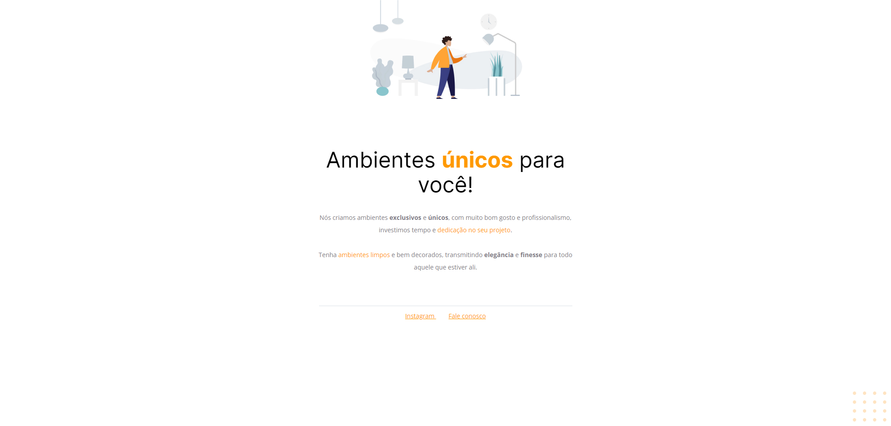

# Móveis Customizados 
Primeiro projeto desenvolvido, no curso Exlorer da Rocketseat.  

[🔗Clique aqui para acessar](httpd://lorenalopesm.github.io/primeiroProjetoExplorer)

## 🛠️ Tecnologias 
- HTML
- CSS
- Git e GitHub

## 📚 O que aprendi
Neste projeto aprendi a mexer em algumas ferramentas iniciais do HTML e do CSS, além de pegar dados do Figma e subir o projeto para o GitHub.

## ✉️ Contato
linkedin.com/in/lorena-lopes-de-macedo
lore.lopees@outlook.com